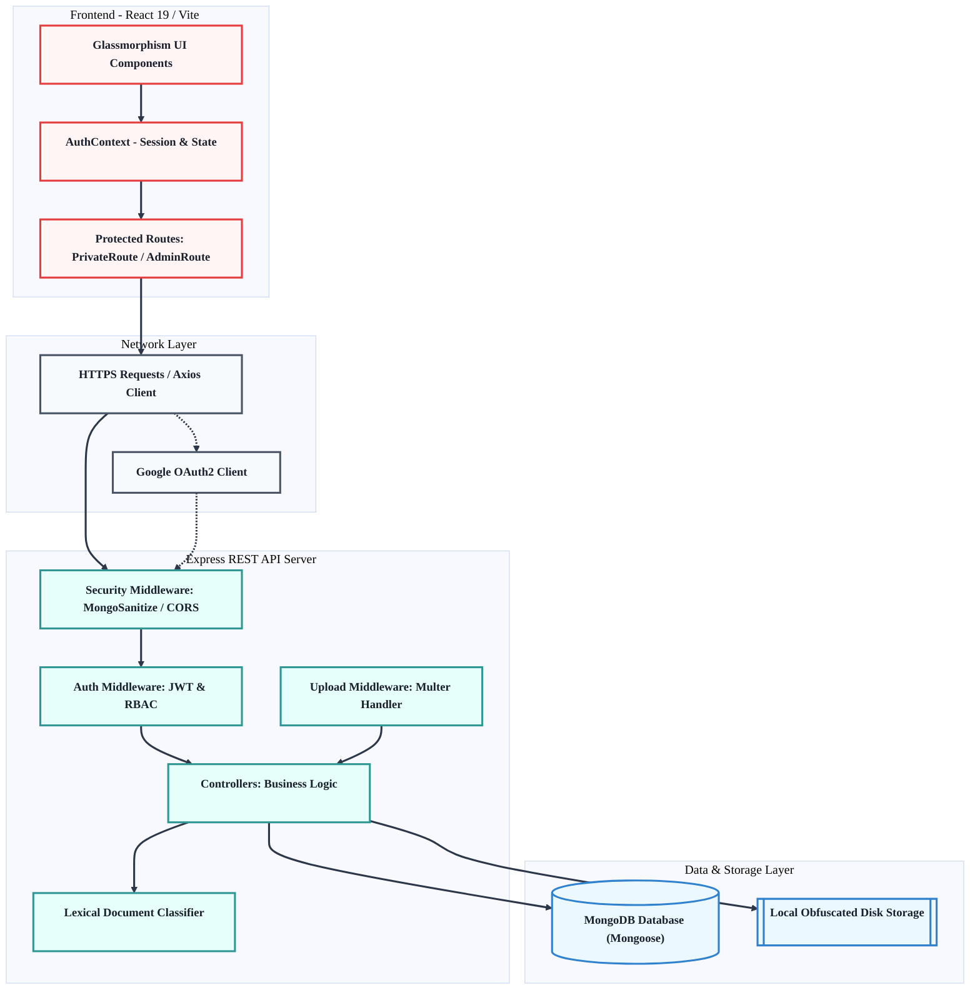
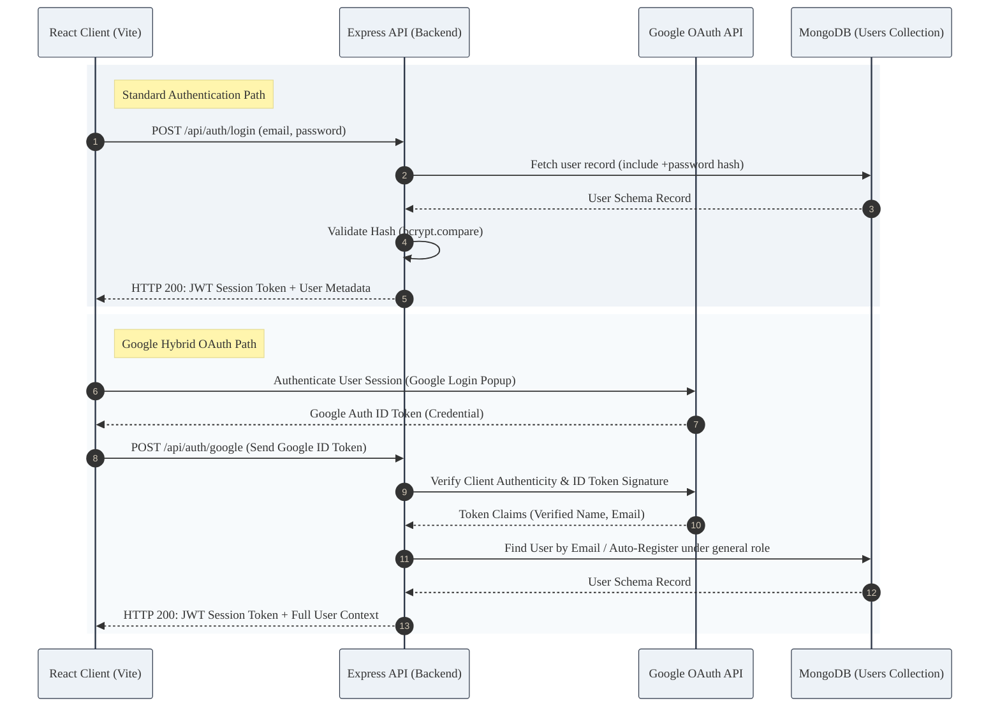
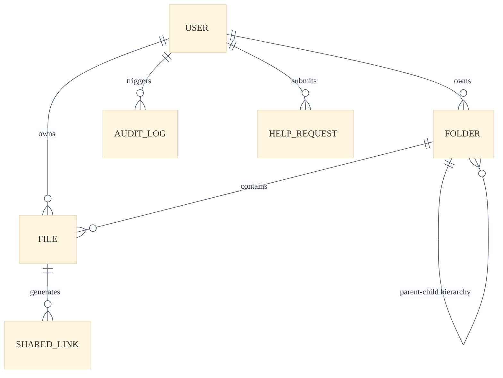
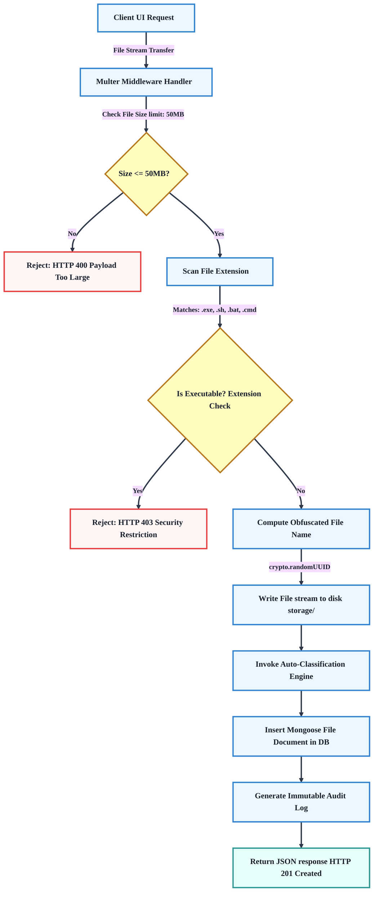
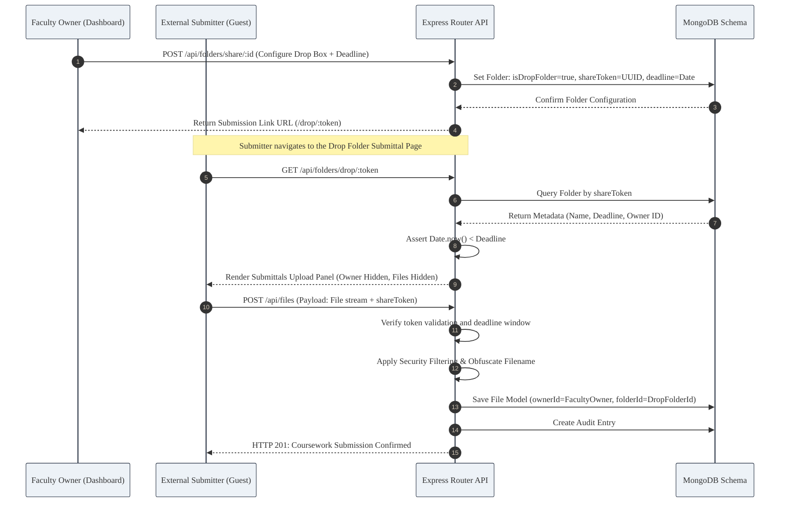

# Secure Campus File Sharing & Document Management System
## Technical Project Documentation & Comprehensive System Blueprints

---

### Executive Overview & Vision
The **Secure Campus File Sharing and Document Management System** is an enterprise-grade, full-stack application designed specifically for academic institutions. In educational ecosystems, sharing resources (assignments, lecture notes, lab records, official circulars) is often fragmented across insecure email threads, messaging apps, and physical USB drives. This results in data silos, loss of historical records, security vulnerabilities, and lack of compliance tracking.

This system resolves these problems by providing:
1. **Isolated Department Drives** and personal storage workspaces.
2. **Granular Role-Based Access Control (RBAC)** (supporting Student, Faculty, Staff, and Admin roles).
3. **Advanced Security Protections** including local file obfuscation, security sanitization, and immutable audit logs.
4. **Intelligent Auto-Classification** using an integrated NLP-lexical classifier.
5. **Advanced Sharing Structures** including tokenized, time-limited file sharing and anonymous "Drop Folders" for secure coursework collection.
6. **Premium Glassmorphism User Interface** tailored to inspire modern interaction while guaranteeing full responsive usability across screens.

---

## 1. System Architecture & Component Interactions

The application is engineered on the **MERN (MongoDB, Express, React, Node.js)** architecture, ensuring high performance, horizontal scalability, and standard Javascript integration across all layers.

### 1.1 High-Level Architecture Diagram



### 1.2 Authentication & Identity Management Flow
Authentication is hybrid, supporting traditional high-strength Bcrypt password logins alongside direct integration with university Google Workspace identities.



---

## 2. Core Database Schema & Entity Relationships

The data layer is modeled using **Mongoose ODM** on MongoDB, utilizing references (`ObjectId`) and index optimizations. Below is the technical schema blueprint of the collections.



### 2.1 User Model (`models/User.js`)
Stores profile information, departmental bindings, and access authorization attributes.
*   **Indices:** `email: 1` (Unique)

| Field | Type | Validation / Defaults | Description |
| :--- | :--- | :--- | :--- |
| `name` | `String` | Required | Legal/Full Name of the user |
| `email` | `String` | Required, Unique, Regexp validated | Institutional Email Address |
| `password` | `String` | Required, Minimum length: 6, `select: false` | Hashed password (Bcrypt, 10 salt rounds) |
| `role` | `String` | Enum: `['student', 'faculty', 'staff', 'admin']`, Default: `student` | Role-Based Access Control identifier |
| `department` | `String` | Enum: `['CSE', 'MCA', 'ECE', 'Placement Cell', 'Examination Cell', 'General']`, Default: `General` | Primary academic department |
| `rollNo` | `String` | Default: `null` | Student Roll Number / Staff Employee ID |
| `isApproved` | `Boolean` | Default: `true` | Approval gate for access control |
| `timestamps` | `Boolean`| Automatic | Creation (`createdAt`) and update (`updatedAt`) dates |

### 2.2 File Model (`models/File.js`)
Maintains metadata representing uploaded documents, their access constraints, and sharing details.
*   **Indices:** `storageName: 1` (Unique), `shareToken: 1` (Sparse Unique), `ownerId: 1`

| Field | Type | Validation / Defaults | Description |
| :--- | :--- | :--- | :--- |
| `originalName` | `String` | Required | User's file name at upload time |
| `storageName` | `String` | Required, Unique | Renamed physical file identifier (UUID) |
| `folderId` | `ObjectId` | Ref: `Folder`, Default: `null` (Root) | Parent folder identification |
| `ownerId` | `ObjectId` | Ref: `User`, Required | Owner who uploaded the resource |
| `mimeType` | `String` | Required | Detected MIME type (e.g., `application/pdf`) |
| `category` | `String` | Default: `Uncategorized` | Auto-classification category output |
| `department` | `String` | Default: `General` | Department assigned for access isolation |
| `academicYear` | `String` | Default: `All` | Targets specific academic classes |
| `isPublicToDepartment` | `Boolean`| Default: `false` | If true, visible on the Department Drive |
| `sizeBytes` | `Number` | Required | Physical size in bytes |
| `shareToken` | `String` | Sparse, Unique | Secure randomized sharing token |
| `isVerified` | `Boolean` | Default: `false` | Signed verification mark by Administrator |
| `shareExpiresAt` | `Date` | Default: `null` | Expiry timestamp for sharing link |
| `shareDownloadLimit`| `Number` | Default: `null` | Download count threshold cap |
| `shareDownloadCount`| `Number` | Default: `0` | Live download tracking |

### 2.3 Folder Model (`models/Folder.js`)
Tracks the virtual directories to organize files and configure anonymous submit dropboxes.
*   **Indices:** `shareToken: 1` (Sparse Unique)

| Field | Type | Validation / Defaults | Description |
| :--- | :--- | :--- | :--- |
| `name` | `String` | Required | Human-readable directory name |
| `parentId` | `ObjectId` | Ref: `Folder`, Default: `null` (Root) | Self-referential ID for tree structures |
| `ownerId` | `ObjectId` | Ref: `User`, Required | Creator of the folder |
| `shareToken` | `String` | Sparse, Unique | Sharing token for anonymous submittals |
| `isDropFolder` | `Boolean` | Default: `false` | Flags folder as an active Drop Folder |
| `deadline` | `Date` | Default: `null` | Cut-off timestamp for Drop submissions |
| `department` | `String` | Default: `General` | Primary department isolation |
| `isPublicToDepartment` | `Boolean`| Default: `false` | True makes it public on Department Drive |

### 2.4 SharedLink Model (`models/SharedLink.js`)
Tracks granular share configurations specifically targeting internal files.

| Field | Type | Validation / Defaults | Description |
| :--- | :--- | :--- | :--- |
| `fileId` | `ObjectId` | Ref: `File`, Required | Target file mapping |
| `token` | `String` | Required, Unique | Generated link path parameter |
| `expiresAt` | `Date` | Default: `null` | Auto-expiration time |
| `accessLimitRole` | `String` | Enum: `['student', 'faculty', 'admin', 'all']`, Default: `all` | Specific roles authorized to open the link |

### 2.5 AuditLog Model (`models/AuditLog.js`)
Provides an immutable security trail logging all critical file, folder, and user actions.

| Field | Type | Validation / Defaults | Description |
| :--- | :--- | :--- | :--- |
| `userId` | `ObjectId` | Ref: `User`, Required | User triggering the system action |
| `action` | `String` | Enum: `['upload', 'download', 'delete', 'share', 'create_folder', 'delete_account']` | Type of interaction performed |
| `entityType` | `String` | Enum: `['file', 'folder', 'user']` | Category of target object |
| `entityId` | `ObjectId` | Required | Database primary key of target object |
| `details` | `String` | Optional description | Extended event context details |
| `ipAddress` | `String` | Captured on HTTP Request | IP Address tracking of initiator |

### 2.6 HelpRequest Model (`models/HelpRequest.js`)
Supports ticket submissions by system users and tracking by platform administrators.

| Field | Type | Validation / Defaults | Description |
| :--- | :--- | :--- | :--- |
| `userId` | `ObjectId` | Ref: `User`, Required | User who filed the ticket |
| `subject` | `String` | Required | Brief description of issue |
| `message` | `String` | Required | Comprehensive problem details |
| `type` | `String` | Enum: `['General', 'Technical Issue', 'Student Account Issue', 'Feature Request']` | Support category |
| `status` | `String` | Enum: `['Pending', 'In Progress', 'Resolved']`, Default: `Pending` | Resolution status |

---

## 3. Deep Dive: Key Technical Workflows

### 3.1 Secure Obfuscated Upload and Security Filtering Flow
Files are parsed using a specialized backend processor. To block execution injection, security filters intercept transfers, enforce bounds, and write streams using physical UUID configurations:



### 3.2 NLP-Lexical Document Classification Engine (`backend/utils/classifier.js`)
When a file is uploaded, the classifier parses the `originalName` using key-patterns matching institutional workflows, falling back to MIME type parsing to categorize files into logical drives:

```javascript
const classifyFile = (filename, mimeType) => {
  const name = filename.toLowerCase();
  
  // High Priority Filename Patterns
  if (name.includes('assignment') || name.includes('hw') || name.includes('homework') || name.includes('project')) {
    return 'Assignments';
  }
  if (name.includes('circular') || name.includes('notice') || name.includes('announcement') || name.includes('memo')) {
    return 'Circulars';
  }
  if (name.includes('lab') || name.includes('record') || name.includes('experiment') || name.includes('practical')) {
    return 'Lab Records';
  }
  if (name.includes('question') || name.includes('paper') || name.includes('exam') || name.includes('test') || name.includes('quiz') || name.includes('midterm')) {
    return 'Question Papers';
  }
  if (name.includes('research') || name.includes('paper') || name.includes('journal') || name.includes('thesis') || name.includes('publication')) {
    return 'Research Papers';
  }
  if (name.includes('syllabus') || name.includes('curriculum')) {
    return 'Syllabus';
  }
  if (name.includes('lecture') || name.includes('notes') || name.includes('slides') || name.includes('presentation')) {
    return 'Lecture Notes';
  }

  // Fallback Category Mapping based on MIME
  if (mimeType.startsWith('image/')) return 'Images';
  if (mimeType.startsWith('video/')) return 'Videos';
  if (mimeType.includes('pdf')) return 'Documents';
  if (mimeType.includes('spreadsheet') || mimeType.includes('excel') || mimeType.includes('csv')) return 'Spreadsheets';
  if (mimeType.includes('presentation') || mimeType.includes('powerpoint')) return 'Presentations';
  if (mimeType.includes('zip') || mimeType.includes('rar') || mimeType.includes('tar')) return 'Archives';
  if (mimeType.includes('text') || mimeType.includes('json') || mimeType.includes('xml')) return 'Text Files';

  return 'Uncategorized';
};
```

### 3.3 Anonymous Drop Folder Submissions
A unique platform feature allowing faculty members to generate a secure submission link. External or unauthenticated users can drop files into that specific collection drive before a pre-configured deadline, completely isolated from seeing other student submittals:



---

## 4. REST API Endpoint Reference

All endpoints are prefix-routed via `/api`. Private endpoints require a valid Bearer JWT passed inside the HTTP Authorization Header.

### 4.1 Authentication Router (`/api/auth`)
*   **Base URL:** `/api/auth`

| Endpoint | Method | Security | Request Body / Params | Response (Success) | Description |
| :--- | :--- | :--- | :--- | :--- | :--- |
| `/register` | `POST` | Public | `{ name, email, password, role, department, rollNo }` | `201: { token, user }` | Standard user registration |
| `/login` | `POST` | Public | `{ email, password }` | `200: { token, user }` | Authenticate using email and password |
| `/google` | `POST` | Public | `{ token }` (Google Credential ID Token) | `200: { token, user }` | Google OAuth Login / Auto-Registration |
| `/me` | `GET` | JWT Private | None | `200: { user }` | Fetch authenticated session profile |
| `/me` | `DELETE` | JWT Private | None | `200: { message }` | Authenticated user deletes own account |
| `/students` | `GET` | JWT Private | Query: `?department=...` | `200: [User]` | Fetches students in a department |

### 4.2 File Management Router (`/api/files`)
*   **Base URL:** `/api/files`

| Endpoint | Method | Security | Request Params / Body | Response (Success) | Description |
| :--- | :--- | :--- | :--- | :--- | :--- |
| `/` | `POST` | JWT Private | `FormData: file, folderId, isPublicToDepartment` | `201: File` | Upload file securely (max 50MB) |
| `/recent` | `GET` | JWT Private | None | `200: [File]` | Fetch 30 most recent uploads |
| `/shared-by-me`| `GET` | JWT Private | None | `200: [File]` | Fetch shared files owned by user |
| `/department` | `GET` | JWT Private | None | `200: { files, folders }` | Fetch shared files/folders of department |
| `/download/:id`| `GET` | JWT Private | Param: `id` (File ID) | Binary Stream (Attachment) | Secured owner/admin file download |
| `/:id/publish` | `PUT` | JWT Private | Param: `id` | `200: File` | Toggle Department Drive public status |
| `/:id/revoke` | `PUT` | JWT Private | Param: `id` | `200: File` | Revoke file shared link token |
| `/:id` | `DELETE` | JWT Private | Param: `id` | `200: { message }` | Delete file from database and storage disk |
| `/:id/notify` | `POST` | JWT Private | Param: `id`, Body: `{ target: 'department'/'all' }` | `200: { message }` | Trigger email alerts to target audience |
| `/share/:id` | `POST` | JWT Private | Param: `id`, Body: `{ expiresHours, downloadLimit }` | `200: { shareToken }` | Generate secure tokenized share link |
| `/shared/info/:token` | `GET` | Public | Param: `token` | `200: SharedFileInfo` | Fetch metadata of shared link |
| `/shared/:token` | `GET` | Public | Param: `token` | Binary Stream (Attachment) | Download file using public shared token |

### 4.3 Folder Management Router (`/api/folders`)
*   **Base URL:** `/api/folders`

| Endpoint | Method | Security | Request Params / Body | Response (Success) | Description |
| :--- | :--- | :--- | :--- | :--- | :--- |
| `/` | `POST` | JWT Private | `{ name, parentId }` | `201: Folder` | Create a new virtual folder directory |
| `/` | `GET` | JWT Private | None (Queries Root Directory) | `200: { folders, files }` | Fetch contents of Root |
| `/:parentId` | `GET` | JWT Private | Param: `parentId` | `200: { folders, files }` | Fetch nested child folder contents |
| `/:id` | `DELETE` | JWT Private | Param: `id` | `200: { message }` | Delete folder and clear child elements |
| `/:id/publish` | `PUT` | JWT Private | Param: `id` | `200: Folder` | Toggle Folder Department Drive public state |
| `/share/:id` | `POST` | JWT Private | Param: `id`, Body: `{ deadline }` | `200: Folder` | Enable folder as a secure Drop Box |
| `/:id/revoke` | `PUT` | JWT Private | Param: `id` | `200: Folder` | Disable Drop Box link and clear token |
| `/drop/:token` | `GET` | Public | Param: `token` | `200: DropFolderInfo` | Fetch Drop Folder data for submission |

### 4.4 Administrator Control Router (`/api/admin`)
*   **Base URL:** `/api/admin` (Enforces strict JWT Authorization check: `req.user.role === 'admin'`)

| Endpoint | Method | Security | Request Params / Body | Response (Success) | Description |
| :--- | :--- | :--- | :--- | :--- | :--- |
| `/logs` | `GET` | Admin | None | `200: [AuditLog]` | Retrieve latest 100 system audit logs |
| `/logs` | `DELETE` | Admin | None | `200: { message }` | Clear all system audit logs |
| `/logs/:id` | `DELETE` | Admin | Param: `id` | `200: { message }` | Delete a single audit log entry |
| `/stats` | `GET` | Admin | None | `200: { stats }` | Retrieve system-wide sizing and counts |
| `/users` | `GET` | Admin | None | `200: [User]` | Fetch all registered system users |
| `/users/:id/files` | `GET` | Admin | Param: `id` (User ID) | `200: [File]` | Fetch files uploaded by a specific user |
| `/users/:id` | `DELETE` | Admin | Param: `id` | `200: { message }` | Delete user and wipe out all associated data |
| `/files/:id` | `DELETE` | Admin | Param: `id` (File ID) | `200: { message }` | Admin-forced physical and database file deletion |
| `/users/:id/approve` | `PATCH`| Admin | Param: `id` | `200: { message, User }` | Approve user registration |
| `/files/:id/verify` | `PATCH`| Admin | Param: `id` | `200: { message, File }` | Toggle verified document status badge |

### 4.5 Support Helpdesk Router (`/api/help`)
*   **Base URL:** `/api/help`

| Endpoint | Method | Security | Request Params / Body | Response (Success) | Description |
| :--- | :--- | :--- | :--- | :--- | :--- |
| `/request` | `POST` | JWT Private | `{ subject, message, type }` | `201: HelpRequest` | Submit a support ticket |
| `/admin/requests` | `GET` | Admin | None | `200: [HelpRequest]` | Fetch all submitted system tickets |
| `/admin/requests/:id` | `PATCH`| Admin | Param: `id`, Body: `{ status: Pending/In Progress/Resolved }` | `200: HelpRequest` | Update ticket status |
| `/admin/requests/:id` | `DELETE`| Admin | Param: `id` | `200: { message }` | Delete support ticket |

---

## 5. UI/UX Design System & Theme Architectural Design

The interface establishes a **Glassmorphism native system** built inside `frontend/src/index.css`. It incorporates floating components, backdrop reflections, and custom blur rules to create a premium digital workspace.

### 5.1 Primary Visual Tokens
*   **Design Language:** Native dark theme utilizing high HSL color ratios.
*   **Background:** Dynamic Mesh Gradient with subtle CSS animations making the layout feel responsive and alive.
*   **Transparency Panels:** `.glass-panel` utilizes `backdrop-filter: blur(16px)` layered over semi-transparent white/gray vectors, accented with a 1px border reflection (`rgba(255, 255, 255, 0.08)`).
*   **Fonts:** `Inter` imported from Google Fonts, utilizing custom weight rules to highlight headings and actions clearly.
*   **Icons:** High-efficiency SVG vector sets driven by `lucide-react`.

### 5.2 Responsive Layout
*   **Navigation:** Fluid header showcasing logged-in role badges and department details. Includes responsive dropdown menus.
*   **Dashboard Layout:** Multi-view dynamic sidebar layout containing options:
    - *My Files / Folders (Workspace Navigation with breadcrumb support)*
    - *Department Drive (Shared organizational drive)*
    - *Recent Uploads*
    - *Shared Links Management Console*
    - *Support Helpdesk Form*
*   **Admin Console:** Grid panels highlighting total user statistics, approval logs, ticket management, and an interactive database activity console with real-time log deletions.

---

## 6. Installation & Configuration Blueprint

### 6.1 Prerequisites
*   **Node.js:** v18.0.0 or higher
*   **MongoDB:** Local instance or cloud account (MongoDB Atlas)
*   **Package Managers:** npm or yarn

### 6.2 Project Configuration (.env files)

#### Backend Configuration (`backend/.env`)
Create a file at `backend/.env`:
```env
PORT=5000
MONGO_URI=mongodb+srv://<username>:<password>@cluster.mongodb.net/fileSharingDB?retryWrites=true&w=majority
JWT_SECRET=your_super_secret_jwt_high_entropy_key_value
EMAIL_USER=your-institutional-email@gmail.com
EMAIL_PASS=your-app-specific-email-password
```

#### Frontend Configuration (`frontend/.env`)
Create a file at `frontend/.env`:
```env
VITE_API_URL=http://localhost:5000/api
VITE_GOOGLE_CLIENT_ID=your-google-oauth-client-id-key.apps.googleusercontent.com
```

### 6.3 Installation Commands

1. **Clone & Directory Setup:**
   Ensure your structure has distinct `backend` and `frontend` folders.

2. **Backend Installation:**
   ```bash
   cd backend
   npm install
   ```

3. **Frontend Installation:**
   ```bash
   cd ../frontend
   npm install
   ```

### 6.4 Seeding the Database & Setup Scripts
The backend contains support scripts to seed and establish default data easily.

*   **Wipe & Seed All Data:** Wipes the database and loads test users (Students, Faculty, Admins) and sets up mock files and directories.
    ```bash
    cd backend
    node wipe-and-seed.js
    ```
*   **Promote User to Admin:** Promotes a registered user's email to the `admin` role instantly.
    ```bash
    node make-admin.js --email=user@domain.edu
    ```
*   **Check Database Connection:** Verifies connectivity to the MongoDB URI config.
    ```bash
    node check-db.js
    ```

### 6.5 Running the Applications Locally

#### Running the Backend
```bash
cd backend
npm run dev   # Triggers nodemon server.js tracking
```

#### Running the Frontend
```bash
cd frontend
npm run dev   # Launches Vite Dev Server on port 5173
```

---

## 7. Security Architecture & Threat Vector Mitigations

This application implements several core security strategies to prevent common vulnerabilities.

### 7.1 NoSQL Injection Mitigation
The Express server utilizes `express-mongo-sanitize` as global middleware:
```javascript
const mongoSanitize = require('express-mongo-sanitize');
app.use(mongoSanitize());
```
This intercepts requests and sanitizes incoming body objects, headers, and queries by stripping off prohibited characters (like `$` and `.`) that are used in MongoDB injection attacks.

### 7.2 Directory Traversal & Storage Obfuscation
Physical uploads are stored inside `backend/storage/`. Files are renamed to randomly generated UUIDs, completely stripping off their original extension on disk (e.g., `storage/8d9b1a2f-3c4d-5e6f-7a8b-9c0d1e2f3a4b`). 
*   **Defense:** Attacks relying on guessable file paths or direct URL access of resource extensions are completely nullified.
*   **Database Isolation:** The physical link to the original filename is safely stored inside the encrypted MongoDB database, queryable only by authenticated requests.

### 7.3 Executable Blocking & Content-Type Security
*   **Extension Filtering:** Checks filename extensions inside the Multer middleware to reject block-listed files (`.exe`, `.sh`, `.bat`, `.cmd`, etc.).
*   **MIME Inspection:** Validates detected content-types, preventing attackers from executing remote shell scripts or deploying malicious code on the server.
