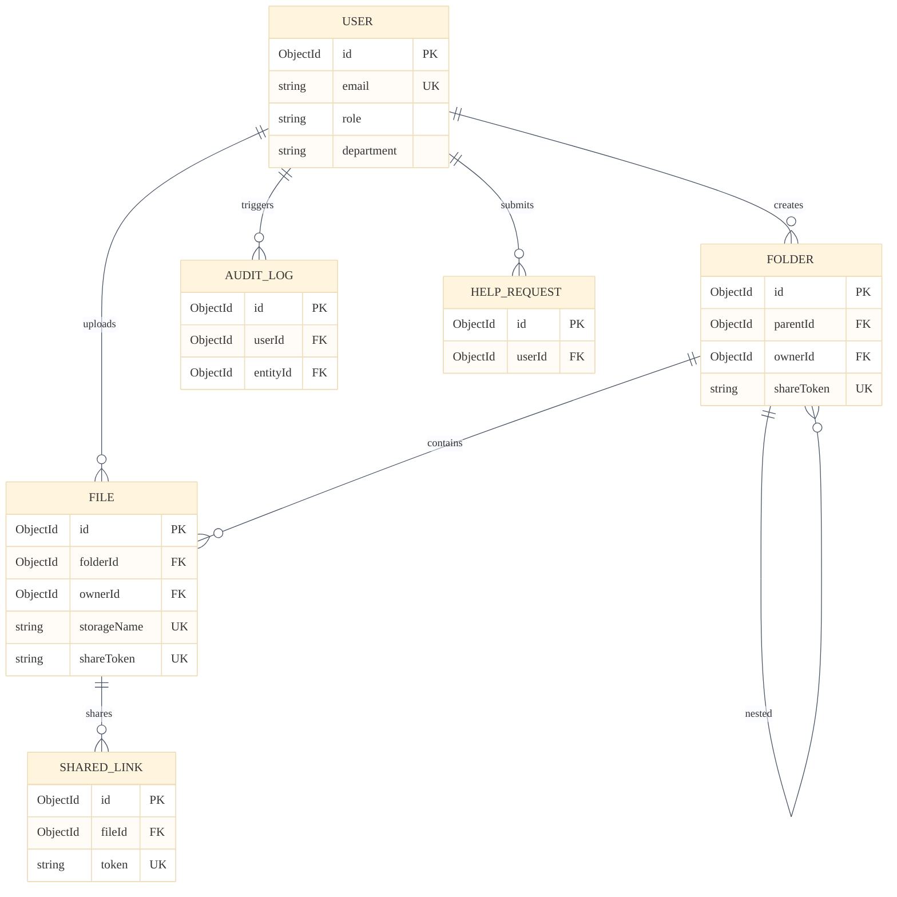
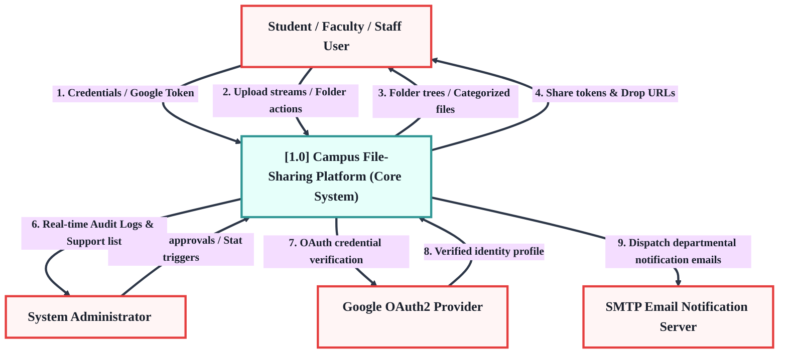
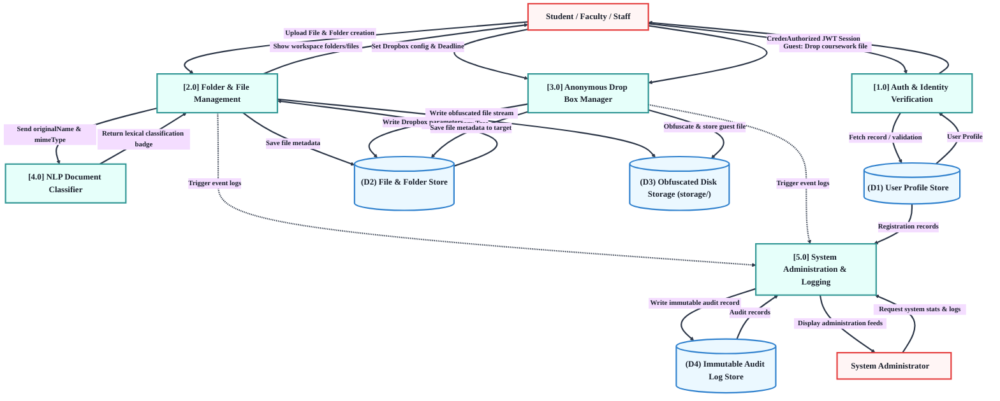
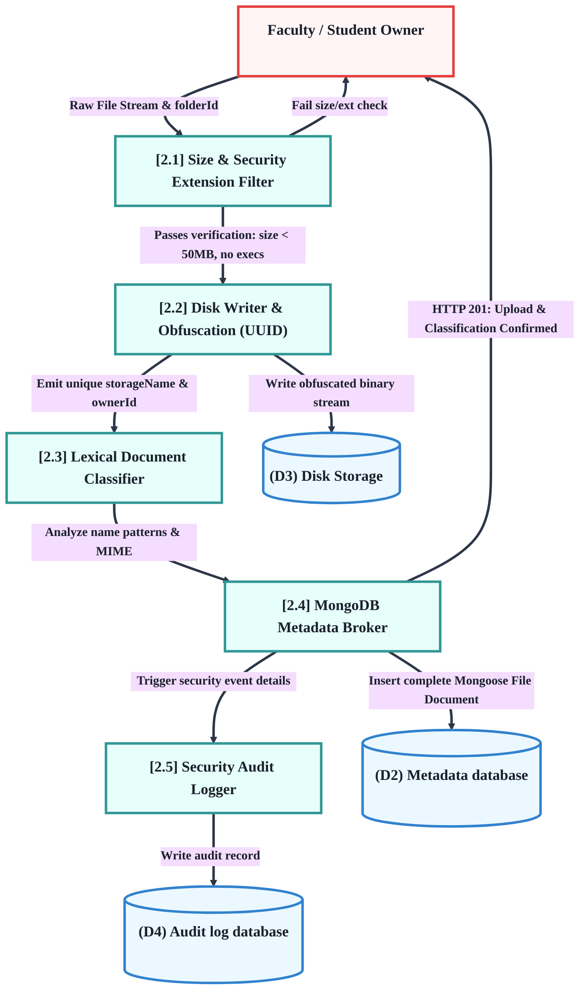

# Campus File-Sharing Platform: Comprehensive System Design Specification

This document outlines the detailed system design blueprint for the **Secure Campus File Sharing and Document Management System**. It covers the complete database architecture (ER Diagrams), multi-level Data Flow Diagrams (DFDs), User Interface wireframes, layout patterns, and high-fidelity design mockups.

---

## 1. Database Design (ER Diagram)

The database is modeled using **MongoDB** (a document-oriented NoSQL database) combined with **Mongoose ODM**. It relies on explicit reference bindings (`ObjectId`) and sparse, unique index configurations to guarantee speed and integrity.

### 1.1 Complete Entity-Relationship (ER) Diagram
The diagram below maps all collections, including properties, exact data types, constraints, and cardinalities.



### 1.2 Data Dictionary Summary
- **Collection `users`:** Manages identity, registration fields, and department scopes. Hashing is applied to credentials via Bcrypt pre-save triggers.
- **Collection `files`:** Records metadata, auto-classified lexical badges, and direct URL mapping parameters.
- **Collection `folders`:** Virtual folders enabling complex multi-level file cataloging, isolated Drop Folder logic, and deadlines.
- **Collection `sharedlinks`:** Handles sharing policies, credentials verification, and roles-based link access.
- **Collection `auditlogs`:** An immutable, queryable track for system audit logs. Uses polymorphic `entityId` for high adaptability.
- **Collection `helprequests`:** Multi-status ticketing pipeline mapping system errors or requests straight to platform administrators.

---

## 2. Data Flow Diagrams (DFD)

Data Flow Diagrams visually detail the pathways, boundary processes, storage hubs, and actors shaping the system.

### 2.1 Level 0 DFD (Context Diagram)
The Context Diagram defines the application's boundary interfaces, showing high-level information streams between external actors and the single centralized File-Sharing core.



---

### 2.2 Level 1 DFD (Functional Process Diagram)
The Level 1 DFD decomposes the system boundaries into five core process bubbles, charting how data traverses operational stages, registers in physical disks, and logs in collections.



---

### 2.3 Level 2 DFD (Detailed File Upload & Verification Process)
Focuses specifically on the multi-tiered upload stream, tracing the progression of data from raw file buffers to classified database indexes and audit trails.



---

## 3. User Interface (UI) Design

The user interface utilizes a custom **Glassmorphism Design System** designed with clean HSL colors and native dark-themed backdrops. This section details the visual layout structural blueprints.

### 3.1 Workspace Dashboard Layout (Wireframe Mapping)
```
+----------------------------------------------------------------------------------------------------+
|  [Logo] Campus File Sharing                [User: Prof. Sharma (Faculty) - CSE Department]         |
+----------------------------------------------------------------------------------------------------+
|  ( ) Sidebar Menu      |  Path: Root / CSE_Resources / Labs /                                      |
|                        |  [+ New Folder]  [^^ Upload File]  [+] Enable Drop Folder                 |
|  [*] My Workspace      +---------------------------------------------------------------------------+
|  [D] Department Drive  |                                                                           |
|  [R] Recent Uploads    |  +---------------------------------------------------------------------+  |
|  [S] Shared Links      |  | [Folder Icon] CSE_Assignments2026   [Drop Box: Active (Expires 8h)]   |  |
|  [H] Help / Support    |  +---------------------------------------------------------------------+  |
|                        |  | [Folder Icon] Lecture_Slides_Notes  [Public: Department Drive]        |  |
|  --------------------  |  +---------------------------------------------------------------------+  |
|  [Storage Usage]       |                                                                           |
|  [=== 42% of 5GB ===]  |  Files:                                                                   |
|                        |  +---------------------------------------------------------------------+  |
|  [Logout Button]       |  | [PDF] Lab1_Instructions.pdf   [3.2 MB]  [Category: Assignments]  [V] |  |
|                        |  +---------------------------------------------------------------------+  |
|                        |  | [DOC] Syllabus_MCA_2026.docx  [1.4 MB]  [Category: Syllabus]     [ ] |  |
|                        |  +---------------------------------------------------------------------+  |
|                        |  | [ZIP] Source_Code_Lab2.zip    [12.8 MB] [Category: Lab Records]  [ ] |  |
|                        |  +---------------------------------------------------------------------+  |
+----------------------------------------------------------------------------------------------------+
```

### 3.2 High-Fidelity UI Mockup
The mockup image below represents the finished product interface. It is configured with animated CSS mesh gradients, glowing frosted cards, backdrop blurs, and distinct colorful category tags representing the automated NLP classification:

*(High-Fidelity Dashboard Mockup displayed below in conversation)*

### 3.3 Core UI Design System Rules
- **Color Architecture:** High-contrast dark backgrounds using curated deep slate HSL scales (`hsl(220, 20%, 8%)`), accented with soft neon purples and blues for interactive components.
- **Glassmorphism Panels:** Frosted cards are styled with `backdrop-filter: blur(16px); background: rgba(255, 255, 255, 0.03)` with a precise `border: 1px solid rgba(255, 255, 255, 0.08)`.
- **Classification Badges:** Color-coded based on category data returned from the classifier:
  - *Assignments:* Emerald Green
  - *Circulars / Circulars:* Amber Yellow
  - *Lab Records:* Intense Cyan
  - *Syllabus:* Royal Purple
  - *Lecture Notes:* Soft Sapphire Blue
  - *Uncategorized:* Slate Grey
